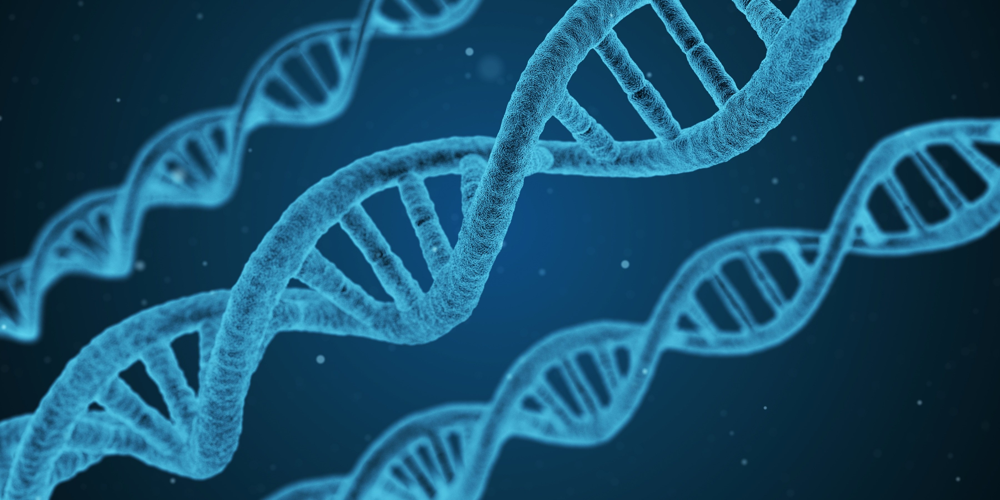
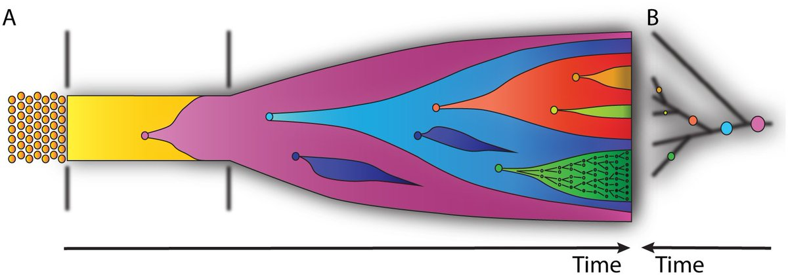

# Computational Cancer Biology and How it Relates to Computer Science

This is an unofficial companion repository to the 2016 paper titled "Computational Cancer Biology: An Evolutionary Perspective" by Beerenwinkel et al. 

This repository is intended to show computer scientists how computational methods can be applied to other fields - using this paper as a starting point to outline the current problems being faced in the field of [computational cancer biology](https://en.wikipedia.org/wiki/Computational_biology#Cancer_computational_biology), especially how it relates to evolution.

## The Evolution of Tumors

Cancer at its core is an evolutionary process. Tumors are made up of many subpopulations of body cells that have mutated to the point where they no longer act or die like a normal cell would: this is how a cancer cell is defined. That is all a cancer cell is: a mutated descendent of a once normal body cell. Because of this, we can look at cancer as an evolutionary process which allows us to exploit its development to drive research in prevention and care.

It is believed that these mutations are ongoing over a person's life rather than occuring all at once when a tumor is formed. Researchers have even been able to observe healthy cells carrying the same cancerous mutations showing this progression. This is a very gradual process and we cannot simply look for mutations in cells to correctly diagnose and treat cancer - we must look at the bigger picture to gain a full understanding of cancer progression.
  
## Current Challenges

### Genome Analysis

We have been able to take samples of tumors to be genetically analyzed for some time now, allowing scientists and doctors to study the diversity and genetics within a tumor. This however is not enough, a single sample leaves gaps in understanding that can make treatment difficult. Now that scientists have developed more methods of sequencing genomes they can take more samples from many different locations which gives a clearer picture of the evolutionary history of cancer. The main difficulty with these new methods is that they generate incredible amounts of data.

Until recently scientists have been unable to realistically process these large amounts of data. Computational methods are becoming more important as time goes on because they are the only way that all of this data can be interpreted. Through a better understanding of the evolutionary history of cancer cells we can be able to predict when it may occur and how to stop it.

### Reconstruction of Genetic History

New sequencing methods are especially important in that they can better detect "driver mutations", or mutations that can cause a cell to become cancerous. We now have the ability to make predictions of how populations of cells will evolve. It is interesting to note, however, that when analyzing cancer genomes that the pathway (evolutionary history) is more important than the contents of the genes themselves. This makes sense because successful phenotypes are successful only because of the environment they are in. There is no inherent "cancer" gene that can be detected. We *can* analyze the history of a population of cancer cells and compare it to current data we have to make predictions based on our current understanding.

> **Representation of cancer evolution.** (A) The left side of this image shows the progression of normal, healthy cells to multiple clonal populations of cancer cells. (B) The right side shows the same information as the left, just represented as a phylogenetic tree.

We are able to sample cells to determine the current range of genetic diversity found in a population. As we can see in the image above, knowledge of this makes it possible, in theory, to paint a picture of the evolutionary history of the population. This proves to be a difficult task due to sampling noise and imperfections within the data. 

This is where computational methods, especially machine learning, comes in. One method used to make sense of all of this data is [hierarchical clustering](https://en.wikipedia.org/wiki/Hierarchical_clustering). This method of clustering can be used to group similar genotypes into a hierarchy in order to reconstruct a phylogenetic tree.

### Predictive Modeling

By combining the above methods we can better create models that accurately predict the population genetics of cancer. Two main methods are common now: using common population genetics models (such as the [Wright-Fisher Model](https://stephens999.github.io/fiveMinuteStats/wright_fisher_model.html) and the [Moran Process](https://en.wikipedia.org/wiki/Moran_process)) to make predictions on the individual level, and using [cellular automata](https://en.wikipedia.org/wiki/Cellular_automaton) to simulate entire systems (populations) to study their progression over time. These two methods open the door to being able to simulate and predict how tumors form, progress, and develop resistance to drugs. More specifically, this could allow us to create software that can predict cancer development and how well treatments will work.

## The Bridge Between Computer Science and Cancer Evolution

### Here is an overview of some of the terms and methods used:

- [Hierarchical Clustering](https://en.wikipedia.org/wiki/Hierarchical_clustering)
- [Cellular Automata](https://en.wikipedia.org/wiki/Cellular_automaton)
- [Bayesian Inference](https://seeing-theory.brown.edu/bayesian-inference/index.html)
- [Mathematical Optimization](https://en.wikipedia.org/wiki/Mathematical_optimization)
- [Heuristic Search](https://users.cs.cf.ac.uk/Dave.Marshall/AI2/node23.html)
- [Cancer Evolution](https://en.wikipedia.org/wiki/Somatic_evolution_in_cancer)
- [Cacner Biology](https://training.seer.cancer.gov/disease/)
- [Wright-Fisher Model](https://stephens999.github.io/fiveMinuteStats/wright_fisher_model.html)
- [Moran Process](https://en.wikipedia.org/wiki/Moran_process)

As you can see in order to solve some of the many problems faced in cancer research, a joint effort between computer scientists and cancer biologists is requred. By combining knowledge of evolution and cancer cell biology with machine learning and other other computational methods many of these roadblocks become less daunting to face.

But why should computer scientists care? I believe that this is one of the greatest opportunities within computer science available to us today. Many of us began studying computer science because of a combined passion for technology and biology (or other field) and are amazed at the work that can be done when we use computers to solve problems associated with these other fields. It is a great opportunity to see the broad impact out expertise can have on the world.

---

# References

Beerenwinkel N, Greenman CD, Langergren J (2016) Computational Cancer Biology: An Evolutionary Perspective. PLoS Comput Biol 12(2): e1004717.doi:10.1371/journal.pcbi.1004717.

This is an open access article distributed under the terms of the Creative Commons Attribution License, which permits unrestricted use, distribution, and reproduction in any medium, provided the original author and source are credited.

Images used in this repository come from the above paper and [Pixabay.com](https://pixabay.com/service/license/)
